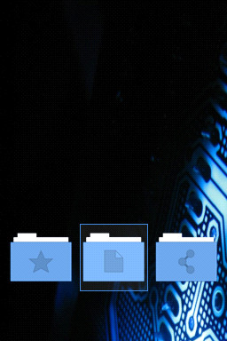
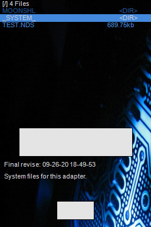
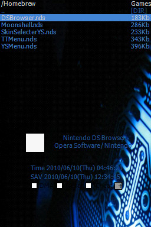

# nds-theme

dark blue nds theme for various homebrew enabling flashcard firmwares

| firmware | theme     | image                                                               |
| :------- | :-------- | :------------------------------------------------------------------ |
| r4       | klassiker |                 |
| wood     | klassiker |   |
| ysmenu   | klassiker |                                         |

## background image by

- [Ethon Zonca](https://protofusion.org/wordpress/2011/08/pcb-backgrounds/)

# notice

I do not support video game piracy in any form. Video game piracy leads to **stupid, short, ad-filled** games.

Buy games and use flashcards to play homebrew or copies you made yourself from your own games.

# hint

If you want to create your own graphics for the wood firmware, open your designed graphic in GIMP and export it to a 16 Bit Windows-Bitmap with:

*File -> Export As... -> Windows-Bitmap -> RGB format: 16 Bit (X1 R5 G5 B5)*

This leads to far better quality then the 16 bit conversions of the various skin editors.
